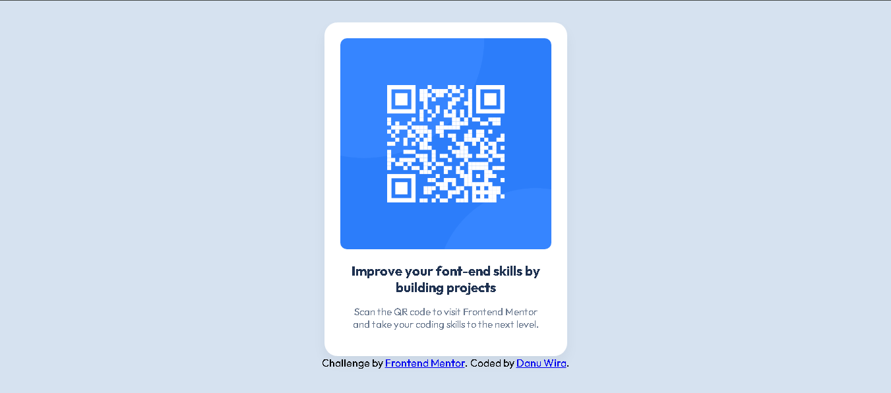

# Frontend Mentor - QR code component solution

This is my solution to the [QR code component challenge on Frontend Mentor](https://www.frontendmentor.io/challenges/qr-code-component-iux_sIO_H). Frontend Mentor challenges help you improve your coding skills by building realistic projects.

## Table of contents

- [Overview](#overview)
  - [Screenshot](#screenshot)
  - [Links](#links)
- [My process](#my-process)
  - [Built with](#built-with)
  - [What I learned](#what-i-learned)
  - [Continued development](#continued-development)
  - [Useful resources](#useful-resources)
- [Author](#author)

## Overview

### Screenshot

### Links

- Solution URL: [https://www.frontendmentor.io/solutions/qr-code-card-my-first-frontend-mentor-solution-4KGegr_2gU](https://www.frontendmentor.io/solutions/qr-code-card-my-first-frontend-mentor-solution-4KGegr_2gU)
- Live Site URL: [https://danuwiradaningrat.github.io/qr-code-challange/](https://danuwiradaningrat.github.io/qr-code-challange/)  

## My process

### Built with

- Semantic HTML5 markup
- CSS custom properties
- Flexbox
- Mobile-first workflow
- Google Fonts – Outfit

### What I learned

I learned how to properly use Flexbox to center elements both horizontally and vertically, and how to build a simple layout based on a visual design. I also learned to make my layout responsive and better control padding and spacing — especially on mobile screens.

### Continued development

In future projects, I want to:
- Explore more structured CSS methodologies like BEM
- Improve my mobile responsiveness workflow
- Use developer tools more effectively for faster layout debugging

### Useful resources

- [MDN Flexbox Guide](https://developer.mozilla.org/en-US/docs/Web/CSS/flex) – Helped me understand how to center the card layout.
- [Frontend Mentor community](https://www.frontendmentor.io/) – Great inspiration and examples from others’ solutions.

## Author

- Frontend Mentor – [@danuwira](https://www.frontendmentor.io/profile/danuwira)
- GitHub – [@danuwira](https://github.com/danuwira)

## Acknowledgments

Thanks to the Frontend Mentor community for providing helpful feedback examples and encouraging beginners to start small!
